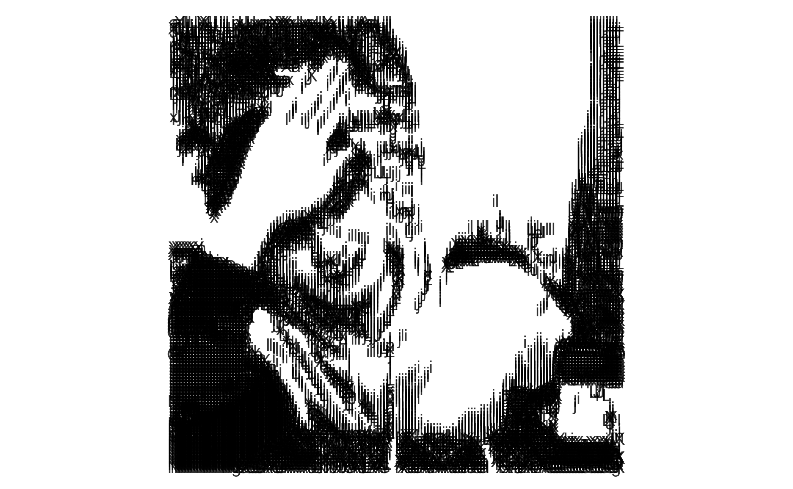

[](https://www.tidyverse.org/lifecycle/#experimental)
[](https://travis-ci.org/JiaxiangBU/add2blog)
[](https://github.com/JiaxiangBU/add2blog)

<!-- README.md is generated from README.Rmd. Please edit that file -->

# add2blog

The goal of add2blog is to help you build some materials like wall paper
for your blog website \!

## Installation

You can install the released version of add2blog from
[Github](https://github.com/JiaxiangBU/add2blog) with:

``` r
devtools::install_github('JiaxiangBU/add2blog')
```

``` r
library(add2blog)
```

## Usage

``` r
library(tidyverse)
#> ─ Attaching packages ───────────────────────── tidyverse 1.2.1 ─
#> ✔ ggplot2 3.1.0     ✔ purrr   0.2.5
#> ✔ tibble  1.4.2     ✔ dplyr   0.7.8
#> ✔ tidyr   0.8.2     ✔ stringr 1.3.1
#> ✔ readr   1.1.1     ✔ forcats 0.3.0
#> ─ Conflicts ────────────────────────── tidyverse_conflicts() ─
#> ✖ dplyr::filter() masks stats::filter()
#> ✖ dplyr::lag()    masks stats::lag()
```

### png2gif

``` r
png2gif(
path = file.path('../','inst')
,input_like = 'reprex'
,output_name = 'reprex201811061210.gif'
)
```

### digit\_plot

1.  Extract the position and corresponding grey degree.
2.  The users give some digits which have corresponding grey degree.
3.  Put the digits (at the similar level of grey degree) into the
    position.

<!-- end list -->

``` r
library(add2blog)
digit_plot(
    digit_raw='lijiaxiang'
    ,img_path=here::here('inst','pic','lijiaxiang.png')
    ,resize = 0.15
    ,bin = 0.4
    ,digit_size = 4
    ,alpha = 0.8
)
# ggsave(here::here('inst','pic','lijiaxiang_digit.png'))
```



## Example

See the [vignettes](https://jiaxiangbu.github.io/add2blog/articles/).
